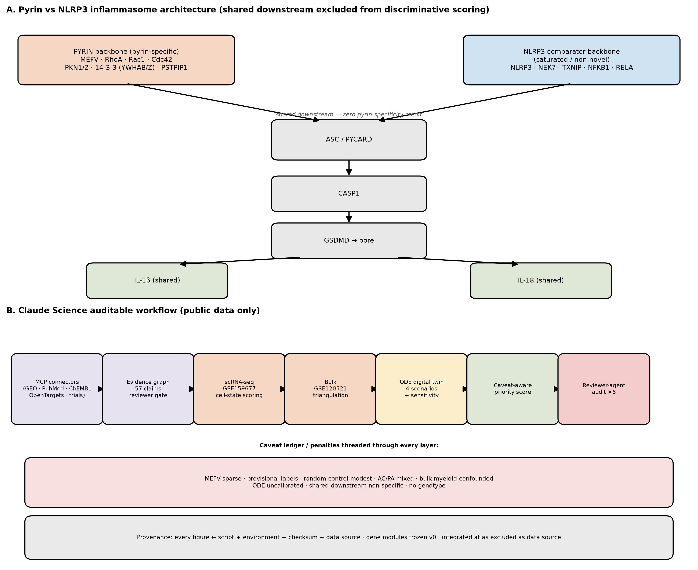
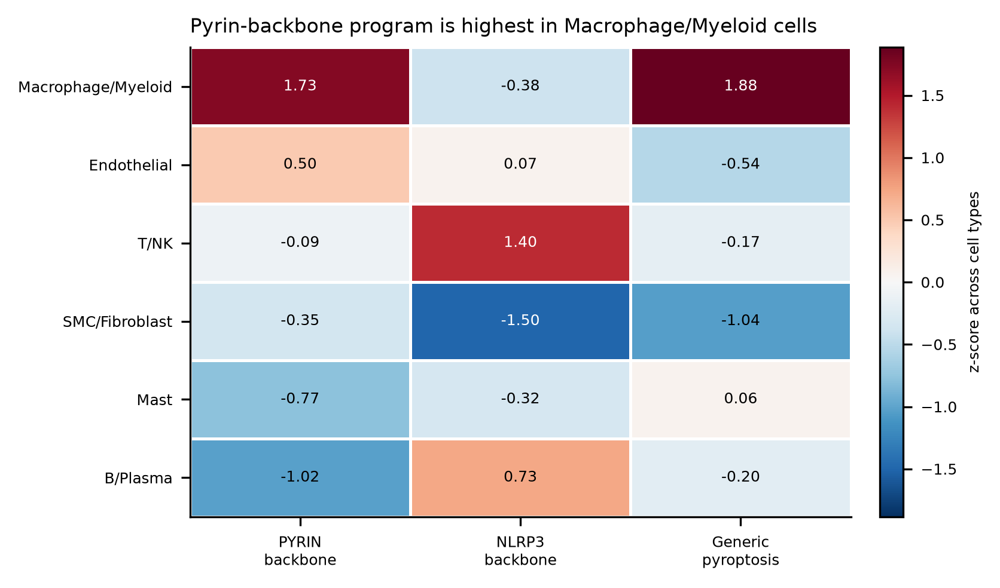
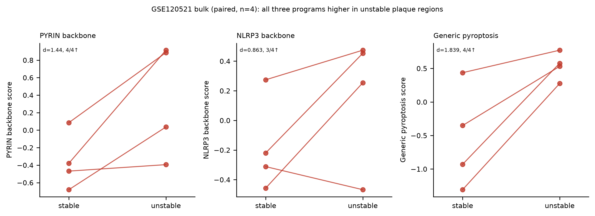
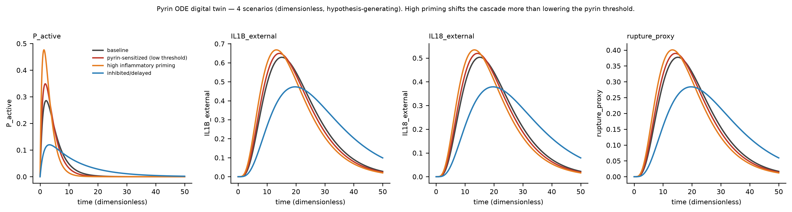
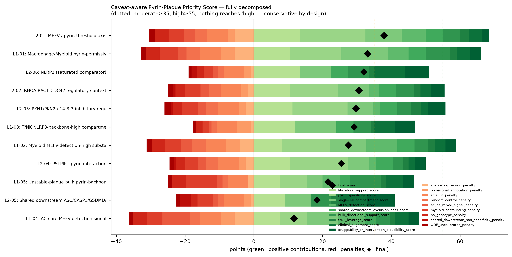

# PYRIN-PLAQUE Digital Twin

**An auditable Claude Science workflow that separates MEFV/pyrin biology from the saturated NLRP3 atherosclerosis literature and maps a caveated myeloid pyrin-permissiveness hypothesis in public plaque data.**

---

## What this is / what this is not

**This is:**
- Public-data-only (no private data, no PHI)
- Hypothesis-generating
- Reproducible (pinned environment, named scripts, checksums)
- Auditable (six reviewer-agent gates, full provenance)
- Claude Science-driven

**This is NOT:**
- Validated target discovery
- A clinical prediction tool
- A drug recommendation
- Proof that MEFV causes atherosclerosis
- Proof that colchicine acts via pyrin in plaque

---

## Why pyrin, not just NLRP3?

The NLRP3 inflammasome in atherosclerosis is **saturated and well-studied** (CANTOS/canakinumab, colchicine trials). Pyrin (encoded by **MEFV**) is a **mechanistically distinct** inflammasome sensor with its own regulatory logic (RhoA/Rac/Cdc42, PKN1/2, 14-3-3, PSTPIP1) — much less mapped in human plaque.

To keep the comparison honest, the **shared downstream effectors** (PYCARD, CASP1, GSDMD, IL1B, IL18) are **excluded from discriminative scoring** — the main comparison is PYRIN_BACKBONE vs NLRP3_BACKBONE. The novelty is **deliberately conservative**: pyrin-specific, cell-state-resolved, auditable integration — *not* "first-ever single-cell + bulk + AI" (that combination is common; 6 atherosclerosis papers in our precedent matrix combine ≥3 such methods).

---

## Claude Science usage

Built end-to-end in Claude Science, beyond chat:
- **MCP connectors:** GEO (omics-archives), PubMed, MyGene (genes-ontologies), ChEMBL, Open Targets (clinical-genomics), ClinicalTrials.gov, InterPro (protein-annotation).
- **Evidence graph:** 57 reviewer-gated literature claims across 5 axes.
- **Public omics analysis:** single-cell scoring + bulk triangulation + a dimensionless pyroptosis ODE.
- **Figure generation:** 5 figures, each from a named script in a pinned environment, with a figure card + checksum.
- **Provenance:** package versions, script/figure/table checksums, environment lock, input checksums.
- **Reviewer-agent gates:** six adversarial gates (Day 1–6); see [reports/reviewer_audit.md](reports/reviewer_audit.md).

---

## Data used

| Dataset | Type | Role | Status |
|---------|------|------|--------|
| **GSE159677** | scRNA-seq (10x), carotid plaque core+adjacent | Primary single-cell | Verified |
| **GSE120521** | Bulk RNA-seq (FPKM), stable/unstable plaque | Bulk triangulation | Verified |
| **GSE253902** | CITE-seq | Stretch (not analyzed in MVP) | Verified, unused |
| **DS_SC_ATLAS_INTEGRATED** | Integrated atlas (PMID 40931012) | — | **Not used as a data source; literature precedent only** |

Gene modules frozen v0 (22 MyGene-validated symbols): PYRIN_MODULE (14), NLRP3_COMPARISON_MODULE (10), GENERIC_PYROPTOSIS_MODULE (8).

---

## Main results

**A. Literature / novelty audit** — 57 reviewer-gated claims; novelty framed conservatively (pipeline not novel; NLRP3 a saturated comparator).

**B. Single-cell (GSE159677, 49,380 cells post-QC)** — MEFV is **sparse overall (~0.97%)** but **myeloid-enriched (Macrophage/Myeloid 4.3%)**. PYRIN_BACKBONE is **highest in Macrophage/Myeloid** (pyrin-specificity delta +0.74) and **survives shared-downstream exclusion**; NLRP3_BACKBONE peaks in a different (T/NK-weighted) compartment. Random matched gene-set control **modest (~82nd percentile)** — suggestive, not definitive.

**C. AC-vs-PA bridge** — MEFV detection **rises in plaque core (AC) in 3/3 patients**, but composite PYRIN_BACKBONE does **not** consistently rise and pyrin-specificity delta **falls** in AC because NLRP3 rises fastest — **mixed result**.

**D. Bulk (GSE120521, n=4 paired)** — PYRIN_BACKBONE **higher in unstable plaque 4/4 patients** (d=1.44), but **myeloid residualization collapses the effect (+0.72 → +0.14, p≈0.69)** — directionally supportive but **myeloid-abundance-confounded**.

**E. ODE digital twin** — dimensionless, uncalibrated; global sensitivity shows **generic priming dominates the pyrin-specific threshold** — **hypothesis-generating only**.

**F. Priority** — caveat-aware score: **MEFV/pyrin threshold axis is top (37.9, moderate confidence)**; **no candidate reaches high confidence**; myeloid-confounded and mixed signals penalty-suppressed to the bottom.

---

## Figures

**Fig 1 — Mechanism + Claude Science workflow**


**Fig 2 — Single-cell cell-state program map**


**Fig 3 — Bulk validation + myeloid confounding**


**Fig 4 — ODE scenarios + sensitivity**


**Fig 5 — Caveat-aware priority ranking**


Figure inventory + checksums: [audit/day6_final_figure_inventory.csv](audit/day6_final_figure_inventory.csv).

---

## Repository structure

```
config/          frozen gene modules, ODE params, scenarios, scoring weights
manifests/       data manifest, evidence table
data/metadata/   sample metadata (no raw data)
evidence/        evidence graph, claim cards, novelty audit
results/tables/  derived tables (scores, deltas, priority, sensitivity)
results/figures/ 5 final figures
results/target_cards/  6 target/cell-state cards
reports/         daily reviews, integrated results, demo, licenses-adjacent docs
reports/figure_cards/  per-figure provenance cards
src/pyrinplaque/ modules, scoring, bulk, ode_twin, priority, plotting, provenance
scripts/         02–06 analysis scripts
tests/           unit tests (13 pass)
audit/           consistency, provenance, reviewer flags, inventories
app/             optional Streamlit demo (static)
```

---

## Reproduce

```bash
# 1. environment
conda env create -f environment.yml      # or: pip install -r requirements-freeze.txt

# 2. fast smoke test (imports, config, gene modules, ODE baseline, output presence)
make smoke

# 3. unit tests
make test        # pytest tests/  -> 13 passed

# 4. regenerate ODE + figures/tables
make figures
make tables
make all          # full reproduction (documented; single-cell step needs raw download)
```

Single-cell reproduction requires downloading GSE159677 (see Data policy) — the scored `.h5ad` (~1.9 GB) is **not** shipped.

---

## Data policy

- **Raw data are NOT committed.** No `data/raw/`, no downloaded GEO matrices, no large `.h5ad`.
- Public accessions + official download instructions are in [DATA_LICENSE.md](DATA_LICENSE.md).
- Input checksums recorded (GSE159677 tar `8cd0b7f8…`, GSE120521 FPKM `27e608a5…`, gene_modules.yaml `f1078086…`).
- Only **derived tables** and **figures** are included.

---

## Reviewer-agent audit

Six adversarial gates on ground-truth computed facts:

| Day | Gate | Result |
|-----|------|--------|
| 1 | Data gate | PROCEED_WITH_CAVEATS (flagged shared-downstream + atlas) |
| 2 | Claim gate | 56 PASS / 1 FLAG of 57 |
| 3 | Single-cell figure gate | 9 PASS / 1 FLAG |
| 4 | Bulk/ODE gate | 11 PASS / 2 FLAG (myeloid confounding; AC/PA mixed) |
| 5 | Priority/ODE gate | 13 PASS / 0 FLAG |
| 6 | Final cross-artifact audit | 13 PASS / 0 FLAG; PROCEED |

Full history + corrections: [reports/reviewer_audit.md](reports/reviewer_audit.md).

---

## Limitations

- Sparse MEFV expression (~0.97% of cells)
- Provisional marker-based cell labels (no published per-cell labels)
- n=3 single-cell patients
- n=4 bulk patients, FPKM only (no raw counts)
- Bulk pyrin signal is myeloid-abundance-confounded
- AC/PA compartment signal is mixed
- No MEFV genotype / FMF stratification
- ODE is dimensionless and uncalibrated
- Integrated atlas not used as a data source
- Public data only

---

## License

- **Code:** MIT — see [LICENSE](LICENSE).
- **Data:** public sources, not redistributed here — see [DATA_LICENSE.md](DATA_LICENSE.md).

---

*PYRIN-PLAQUE identifies a suggestive myeloid pyrin-permissiveness pattern and prioritizes the MEFV/pyrin threshold axis for future validation, while showing that much of the bulk signal is myeloid-abundance-confounded and that generic inflammatory priming may dominate over pyrin-specific threshold effects. It is an auditable hypothesis engine, not a validated-target or clinical claim.*
